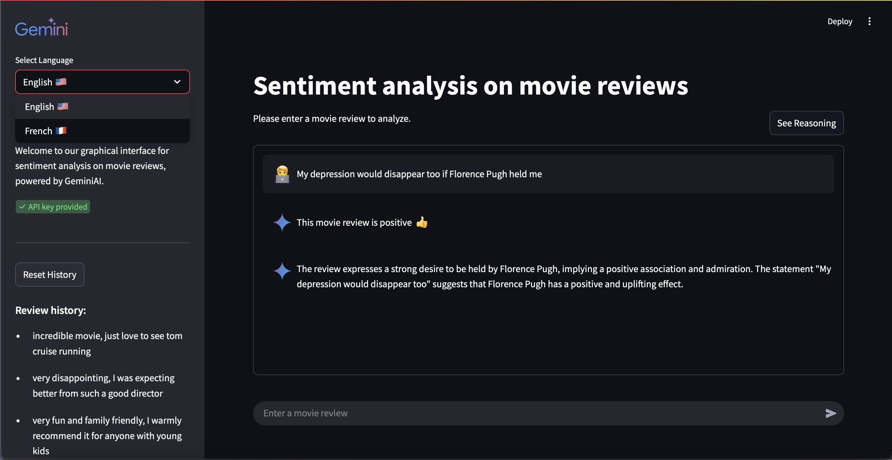

# Movie Reviews Classification Project

A movie reviews classification project supported by AI models.

## Description 

This project was developed during my 4th year at ESME Engineering School as part of my exploration of Natural Language Processing (NLP) techniques and models.
The work focused on experimenting with different approaches for sentiment analysis of movie reviews, using both custom-built datasets and the IMDb movie reviews dataset. The experiments included:

- Fine-tuning a BERT model for classification.
- Testing multiple Large Language Models (LLMs) via API calls (e.g., Gemini, Mistral).

The repository includes:

- Jupyter notebooks detailing experiments, training, evaluation, and performance comparisons across datasets and models.
- A final application that provides an intuitive interface to interact with the best-performing model—Gemini—for the movie review classification task, allowing users to input a comment and receive a sentiment prediction.

This project showcases both the experimental process (model selection, tuning, and evaluation) and the practical deployment of the chosen model through a working application.

